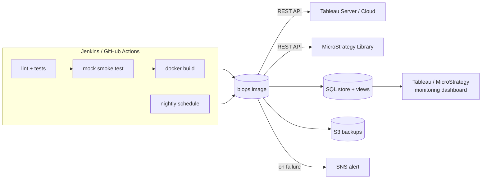

# bi-platform-ops

A small DevOps toolkit that runs **Tableau** and **MicroStrategy (Strategy ONE)** like any other production platform: health checks, content inventory, usage tracking, backups and refreshes, all driven over the vendors' REST APIs from Jenkins or GitHub Actions, with results stored in SQL and backups shipped to AWS.

One Python CLI, one container image, five commands:

| Command | What it does | Tableau | MicroStrategy |
|---|---|---|---|
| `biops health` | Checks the platform is up; exits 1 and sends an SNS alert if not | server reachable, PAT sign-in | Library reachable, login, every cluster node running, every project loaded |
| `biops collect` | Snapshots what content exists and how much it is used | workbooks, data sources, view counts | reports, cubes, documents, dossiers per project |
| `biops backup` | Backs up content, records size and SHA-256, copies to S3 | downloads every `.twb`/`.twbx` | JSON manifest of every object per project |
| `biops refresh` | Triggers data refreshes | extract refresh per data source | Intelligent Cube republish |
| `biops report` | Prints (or exports to CSV) the monitoring views | | |

Plus `biops publish`, used by CI to deploy workbooks from Git to Tableau, and `scripts/linux_health.sh` for the host itself (disk, memory, load, services, pending patches).



## Try it in two minutes (no licences needed)

Mock mode swaps both platforms for built-in stand-ins, so everything runs offline.

```bash
make install      # venv + dependencies
make test         # 13 unit tests
make demo         # health -> 3 days of snapshots -> backup -> refresh -> report
```

To see the failure path (a MicroStrategy project that is not loaded):

```bash
BIOPS_MOCK=1 BIOPS_MOCK_FAIL=1 .venv/bin/python -m biops health; echo "exit code: $?"
```

## How it maps to the eBay job description

| The posting asks for | Where it is in this repo |
|---|---|
| Admin experience on Tableau and MicroStrategy/Strategy | `biops/tableau.py`, `biops/mstr.py` |
| Monitoring health and performance of the system | `biops health`, `scripts/linux_health.sh`, views `v_latest_health`, `v_availability_7d` |
| Automate BI platform activities with Python/Shell | the whole `biops` package; `scripts/linux_health.sh` |
| Build Jenkins pipelines and GitHub Actions | `Jenkinsfile`, `.github/workflows/ci.yml`, `.github/workflows/nightly-ops.yml` |
| Frameworks for refresh data source/report and regular backup via REST APIs | `biops backup`, `biops refresh` |
| Dashboards for BI user tracking, usage monitoring and reporting | `biops collect` + `sql/schema.sql` (`v_daily_views`, `v_stale_content`), `biops report --csv` |
| SQL, data warehousing and relational concepts | `sql/schema.sql`: snapshot tables, window function (`LAG`) for daily deltas, idempotent loads |
| Maintain Linux servers on-prem and in cloud; patching | `scripts/linux_health.sh` (reports the patch backlog), `Dockerfile`, self-hosted runner in the nightly workflow |
| Security, user access, compliance | PAT / service-account auth, secrets only in CI credential stores, least-privilege IAM policy, encrypted + versioned S3 bucket, non-root container |
| Stable, scalable solutions optimized for monitoring | non-zero exit codes, per-item failure isolation, every run logged to `job_log` |
| "Automate first", SOPs and documentation | this README; each command replaces a manual admin runbook step |

## Layout

```
biops/
  tableau.py   Tableau REST client (sign-in, paging, inventory, usage, backup, refresh, publish)
  mstr.py      MicroStrategy REST client (login, cluster monitor, search, cube publish)
  mock.py      offline stand-ins for both, used by tests, CI and demos
  tasks.py     the four operations, written once against a common client interface
  store.py     SQLite writer
  aws.py       optional S3 upload and SNS alert
  cli.py       python -m biops <command>
sql/schema.sql       tables + the five views a dashboard reads
scripts/linux_health.sh
tests/               unit tests with a fake HTTP session, plus an end-to-end test
Jenkinsfile          CI + nightly ops, credentials per environment
.github/workflows/   ci.yml (test, build, promote workbooks) and nightly-ops.yml (dev/prod matrix)
terraform/main.tf    S3 backup bucket, SNS topic, CI IAM policy
Dockerfile, Makefile, .env.example
```

## Pointing it at real servers

1. Copy `.env.example` to `.env`, remove `BIOPS_MOCK`, and fill in whichever platform you have. Either one alone works.
2. **Tableau**: create a Personal Access Token (My Account Settings) and set `TABLEAU_URL`, `TABLEAU_SITE`, `TABLEAU_PAT_NAME`, `TABLEAU_PAT_SECRET`. A site administrator token sees all content.
3. **MicroStrategy**: set `MSTR_URL` to the Library address (ends in `/MicroStrategyLibrary`) and a service account in `MSTR_USER` / `MSTR_PASSWORD`. The cluster monitor call needs an administrator privilege. Every endpoint is browsable on your own server at `<MSTR_URL>/api-docs`.
4. `set -a; . ./.env; set +a; python -m biops health`

For practice environments: Tableau's Developer Program has offered a free personal Tableau Cloud site, and the MicroStrategy REST documentation runs its samples against a public demo Library. Check what each currently offers; a public demo will not grant the admin rights the cluster monitor needs.

**AWS (optional):** `cd terraform && terraform init && terraform apply -var bucket_name=... -var alert_email=...`, then set `BIOPS_S3_BUCKET` and `BIOPS_SNS_TOPIC_ARN` from the outputs.

## CI/CD

- **Every commit** (`ci.yml` / first three Jenkins stages): ruff, shellcheck, unit tests, a full mock-mode run, then the Docker image build. The mock run means the pipeline is tested end to end without touching a BI server.
- **Merge to main** (`promote` job): any `.twb`/`.twbx` under `workbooks/` is published to Tableau, behind the `prod` environment's approval gate. This is BI content treated as code: reviewed in a pull request, deployed by the pipeline, not by hand.
- **Nightly** (`nightly-ops.yml` / Jenkins `Nightly ops` stage): host health, platform health, collect, backup, refresh, for each environment in the matrix. Health runs first so a broken platform fails fast and alerts before a backup is attempted. AWS access is through OIDC role assumption, so no access keys are stored.

## The dashboard

`biops report --csv out/` writes each view to CSV; connect Tableau or MicroStrategy to those files (or point them straight at the database once it lives in Postgres) and build:

- **Platform status**: `v_latest_health` as a red/green grid, `v_availability_7d` as the SLA number.
- **Adoption**: `v_daily_views` by project and workbook over time.
- **Clean-up list**: `v_stale_content`, content nobody has touched in 180 days.
- **Ops log**: `v_recent_jobs`, last backups and refreshes with sizes and failures.

## What is and is not verified

- Verified here: the 13 unit tests, the end-to-end mock run, and `linux_health.sh` on Ubuntu.
- The Tableau and MicroStrategy clients are tested against a fake HTTP layer built from the documented request and response shapes. They have **not** been run against live servers, so expect small adjustments on first contact (field names can differ between versions).
- The `Jenkinsfile`, workflows, `Dockerfile` and `terraform/main.tf` are written to be run but were not executed in the environment this was built in. Run `terraform validate` and one pipeline run before relying on them.

## Next steps

- **MicroStrategy usage**: run history is not exposed over REST; it lives in Platform Analytics. Add a collector that queries that warehouse with SQL and writes into `usage_snapshot`.
- **Real MicroStrategy backups and promotion**: metadata database dump plus migration packages (`/api/packages`, `/api/migrations`) to move objects dev to prod.
- **Postgres** instead of SQLite once more than one runner writes to the store.
- **User and permission audit**: snapshot users, groups and site roles to catch access drift.
- **Upgrade rehearsal**: before a server upgrade, run `collect` + `backup`, upgrade, run again, and diff the two inventories.
