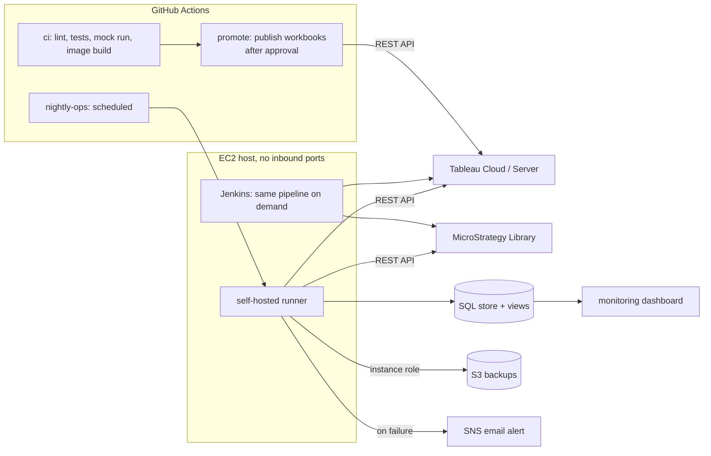

# bi-platform-ops

A small DevOps toolkit that runs **Tableau** and **MicroStrategy (Strategy ONE)** like any other production platform: health checks, content inventory, usage tracking, backups and refreshes, all driven over the vendors' REST APIs from GitHub Actions or Jenkins, with results stored in SQL, backups shipped to S3 and failures alerted through SNS.

One Python CLI, one container image, six commands:

| Command | What it does | Tableau | MicroStrategy |
|---|---|---|---|
| `biops health` | Checks the platform is up; exits 1 and sends an SNS alert if not | server reachable, PAT sign-in | Library reachable and backed by an Intelligence Server, login, every cluster node running, every project loaded |
| `biops collect` | Snapshots what content exists and how much it is used | workbooks, data sources, view counts | reports, cubes, documents, dossiers per project |
| `biops backup` | Backs up content, records size and SHA-256, copies to S3 | downloads every `.twb`/`.twbx` | JSON manifest of every object per project |
| `biops refresh` | Triggers data refreshes | extract refresh per data source | Intelligent Cube republish |
| `biops report` | Prints (or exports to CSV) the monitoring views | | |
| `biops publish` | Publishes a workbook; used by CI to deploy from Git | overwrite-publish into a project | |

Plus `scripts/linux_health.sh` for the host itself (disk, memory, load, services, pending patches).



## Try it in two minutes (no licences needed)

Mock mode swaps both platforms for built-in stand-ins, so everything runs offline.

```bash
make install      # venv + dependencies
make test         # 16 unit tests
make demo         # health -> 3 days of snapshots -> backup -> refresh -> report
```

To see the failure path (a MicroStrategy project that is not loaded):

```bash
BIOPS_MOCK=1 BIOPS_MOCK_FAIL=1 .venv/bin/python -m biops health; echo "exit code: $?"
```

## How it maps to a BI DevOps / platform admin role

| Typical requirement | Where it is in this repo |
|---|---|
| Admin experience on Tableau and MicroStrategy/Strategy | `biops/tableau.py`, `biops/mstr.py` |
| Monitoring health and performance of the system | `biops health`, `scripts/linux_health.sh`, views `v_latest_health`, `v_availability_7d`, SNS alerts |
| Automate BI platform activities with Python/Shell | the whole `biops` package; `scripts/linux_health.sh` |
| Build Jenkins pipelines and GitHub Actions | `Jenkinsfile`, `.github/workflows/ci.yml`, `.github/workflows/nightly-ops.yml` |
| Frameworks for refresh and regular backup via REST APIs | `biops backup`, `biops refresh` |
| Dashboards for BI usage monitoring and reporting | `biops collect` + `sql/schema.sql` (`v_daily_views`, `v_stale_content`), `biops report --csv` |
| SQL, data warehousing and relational concepts | `sql/schema.sql`: snapshot tables, window function (`LAG`) for daily deltas, idempotent loads |
| Maintain Linux servers on-prem and in cloud; patching | `terraform/runner.tf` (Ubuntu host), `scripts/linux_health.sh` (reports the patch backlog), `Dockerfile` |
| Security, user access, compliance | token and service-account auth, secrets only in CI credential stores, instance role instead of stored AWS keys, host with no inbound ports, least-privilege IAM policy, encrypted and versioned bucket, approval gate before publishing, non-root container |
| Stable, scalable solutions optimized for monitoring | non-zero exit codes, per-item and per-platform failure isolation, every run logged to `job_log` |
| "Automate first", SOPs and documentation | this README; each command replaces a manual admin runbook step |

## Layout

```
biops/
  tableau.py   Tableau REST client (sign-in, paging, inventory, usage, backup, refresh, publish)
  mstr.py      MicroStrategy REST client (login, cluster monitor, search, cube publish)
  mock.py      offline stand-ins for both, used by tests, CI and demos
  tasks.py     the four operations, written once against a common client interface
  store.py     SQLite writer
  aws.py       optional S3 upload and SNS alert
  cli.py       python -m biops <command>
sql/schema.sql       tables + the five views a dashboard reads
scripts/linux_health.sh
tests/               unit tests with a fake HTTP session, plus an end-to-end test
.github/workflows/   ci.yml (test, build, promote workbooks) and nightly-ops.yml (scheduled ops)
Jenkinsfile          the same CI stages plus an on-demand ops run
terraform/main.tf    S3 backup bucket, SNS topic, CI IAM policy
terraform/runner.tf  EC2 runner host: instance role, Session Manager access, no inbound ports
workbooks/           Tableau workbooks deployed by the promote job
Dockerfile, Makefile, ruff.toml, .env.example
```

## Configuration

Everything is an environment variable, so the same code runs on a laptop, a runner or in a container. See `.env.example`.

| Variable | Purpose |
|---|---|
| `BIOPS_ENV`, `BIOPS_DB`, `BIOPS_BACKUP_DIR` | environment label, SQLite path, local backup folder |
| `BIOPS_MOCK` | `1` = use the offline stand-ins |
| `BIOPS_S3_BUCKET`, `BIOPS_SNS_TOPIC_ARN` | optional: copy backups to S3, alert on failed health checks |
| `TABLEAU_URL`, `TABLEAU_SITE`, `TABLEAU_PAT_NAME`, `TABLEAU_PAT_SECRET` | Tableau server, site and Personal Access Token |
| `TABLEAU_BACKUP_PROJECT`, `TABLEAU_REFRESH_DATASOURCES` | optional: limit backups to one project; data source ids to refresh |
| `MSTR_URL`, `MSTR_USER`, `MSTR_PASSWORD`, `MSTR_LOGIN_MODE` | Library URL and account (`1` standard, `16` LDAP, `8` guest) |
| `MSTR_CLUSTER_CHECK` | `0` = skip the cluster monitor when the account has no administrator privilege |
| `MSTR_REFRESH_CUBES` | cubes to republish, as `projectId:cubeId` |

## Pointing it at real servers

1. Create a `.env` with the variables for whichever platform you have. Either one alone works.
2. **Tableau**: create a Personal Access Token under My Account Settings. On newer Tableau Cloud sites a site administrator first has to enable tokens under Settings > General > Personal Access Tokens.
3. **MicroStrategy**: set `MSTR_URL` to the Library address (ends in `/MicroStrategyLibrary`). The cluster monitor needs an administrator privilege; without one, set `MSTR_CLUSTER_CHECK=0`. Every endpoint is browsable on your own server at `<MSTR_URL>/api-docs`.
4. `set -a; . ./.env; set +a; python -m biops health`

**AWS:** `cd terraform && terraform init && terraform apply -var bucket_name=... -var alert_email=...` creates the bucket, the alert topic, the IAM policy and the runner host. Confirm the SNS subscription email, then set `BIOPS_S3_BUCKET` and `BIOPS_SNS_TOPIC_ARN` from the outputs.

## CI/CD

- **Every commit** (`ci.yml`, and the first three Jenkins stages): ruff, shellcheck, unit tests, a full mock-mode run, then the Docker image build. The mock run tests the pipeline end to end without touching a BI server.
- **Merge to main** (`promote` job): any `.twb`/`.twbx` under `workbooks/` is published to Tableau once a required reviewer approves the `prod` environment. BI content is treated as code: reviewed in a pull request and deployed by the pipeline, not by hand.
- **Nightly** (`nightly-ops.yml`): host health, platform health, collect, backup and refresh on a self-hosted runner. Secrets and settings live in a GitHub environment per BI environment. AWS access comes from the runner's instance role, so no keys are stored. Each step runs even if an earlier one failed: a platform that is down turns the run red and sends an alert, but does not stop the other platform from being collected and backed up.
- **Jenkins** (`Jenkinsfile`): the same CI stages, plus an "Ops run" stage when `RUN_OPS` is ticked. It needs two credentials per environment: `tableau-pat-<env>` (username with password) and `biops-env-<env>` (secret file of `KEY=value` settings). It has no timer on purpose: one scheduler owns the nightly run, otherwise every alert and refresh would be doubled.

The runner host has no SSH key and no open ports. Shell access and the Jenkins UI both go through AWS Session Manager (the UI through a port-forwarding session to `localhost:8080`).

## The dashboard

`biops report --csv out/` writes each view to CSV; connect Tableau or MicroStrategy to those files (or straight to the database once it lives in Postgres) and build:

- **Platform status**: `v_latest_health` as a red/green grid, `v_availability_7d` as the SLA number.
- **Adoption**: `v_daily_views` by project and workbook over time.
- **Clean-up list**: `v_stale_content`, content nobody has touched in 180 days.
- **Ops log**: `v_recent_jobs`, last backups and refreshes with sizes and failures.

## What has been verified

Run for real, October 2026:

- **Tableau Cloud** (2026.2, REST API 3.29): health, inventory, usage, backup of every workbook, refresh trigger, and publishing a workbook through the `promote` job after approval. The published workbook was one the backup had downloaded, so the backups were also shown to be restorable.
- **MicroStrategy** (public demo Library, guest login): reachability, login, inventory of about 3,100 objects, and per-project manifests.
- **AWS**: everything in `terraform/` applied in `ca-central-1`; backups uploaded to S3 from a laptop and, through the instance role, from a container on the runner host; SNS alerts delivered.
- **GitHub Actions**: `ci` green including shellcheck and the image build; `nightly-ops` on the self-hosted runner, manually and on schedule; `promote` behind a required reviewer.
- **Jenkins** (2.580 LTS on the runner host): CI stages and the ops run, with credentials from the Jenkins store and AWS access from the instance role.
- **Alerting on a real incident**: the demo server stopped accepting logins (a timeout, later HTTP 500). The scheduled run alerted by email, the run went red, and Tableau was still collected and backed up.

Not yet verified against a live server:

- MicroStrategy **cluster monitor** and **cube republish**. Both need an administrator account; the demo's guest gets HTTP 403. They are covered by unit tests only.
- The **dashboard** itself has not been built yet.

## Lessons from first contact with real servers

- **"Queued" is not "succeeded".** `biops refresh` reports that Tableau accepted the request. The test data source was a CSV-based extract, which Tableau Cloud can only refresh through Tableau Bridge, so the jobs it queued failed on Tableau's side while the tool reported `ok`. Checking each job's final status is the first item under next steps.
- **Documented response shapes are a starting point.** The MicroStrategy status endpoint returned uptime and an "Intelligence Server configured" flag, not the version field first assumed; the check was rewritten around what the server actually sends.
- **A check that always fails trains people to ignore alerts.** The cluster monitor can never pass for a guest, so it became an explicit setting instead of a permanent red line.
- **One platform's outage should not block another's backup.** The first design stopped the run at the first failed health check. A real outage showed why that was wrong.
- **Linter defaults move.** A newer ruff release enforced more rules than the code was written against. Deliberate exceptions (broad `except` at isolation boundaries) are documented in `ruff.toml`.

## Next steps

- **Refresh job status**: poll each queued job and fail the run when the refresh itself fails.
- **MicroStrategy usage**: run history is not exposed over REST; it lives in Platform Analytics. Add a collector that queries that warehouse with SQL and writes into `usage_snapshot`.
- **Real MicroStrategy backups and promotion**: metadata database dump plus migration packages to move objects from dev to prod.
- **Postgres** instead of SQLite once more than one runner writes to the store; it also gives Tableau a data source it can refresh without Bridge.
- **User and permission audit**: snapshot users, groups and site roles to catch access drift.
- **Upgrade rehearsal**: before a server upgrade, run `collect` + `backup`, upgrade, run again, and diff the two inventories.
- **Jenkins agents**: move builds off the controller onto a separate agent.
